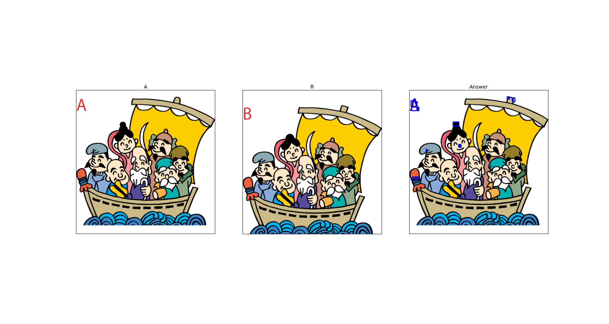
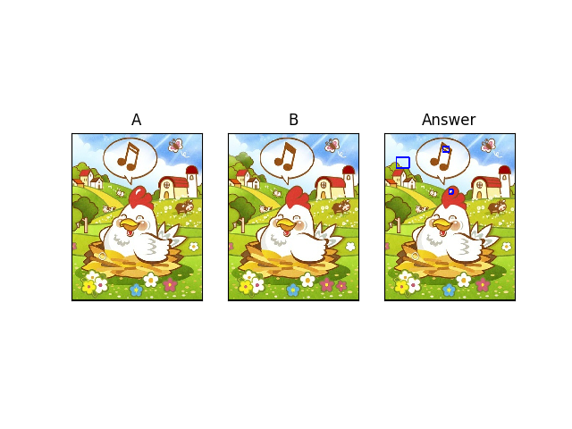

# 简介
通过opencv,识别出两张图片不同部分。俗称大家一起来找茬

# 从github clone代码
```
git clone https://github.com/lyyyd/jester.git
```

# 环境
- git
- Python 3.7.4
- pip 20.1.1
- opencv 3.4.2

# 安装opencv
```
pip install opencv-python==3.4.2
```

# 查看opencv版本
```
python
>>> import cv2
>>> cv2.__version__
```

# 运行
```
python image_detect_03.py --source_image=***.png --target_image=***.png
```

# 效果图

